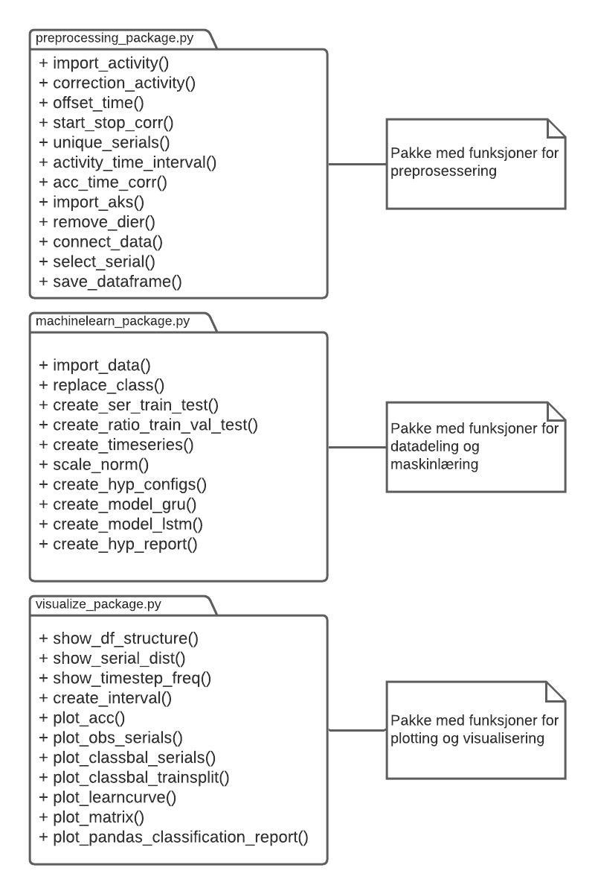
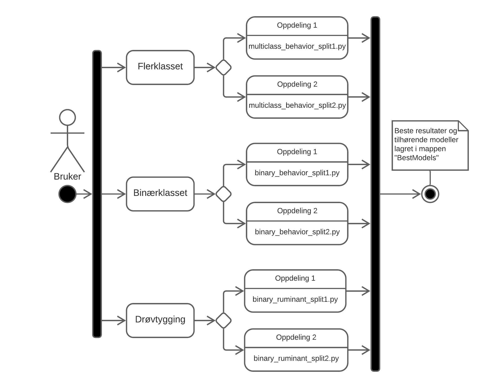
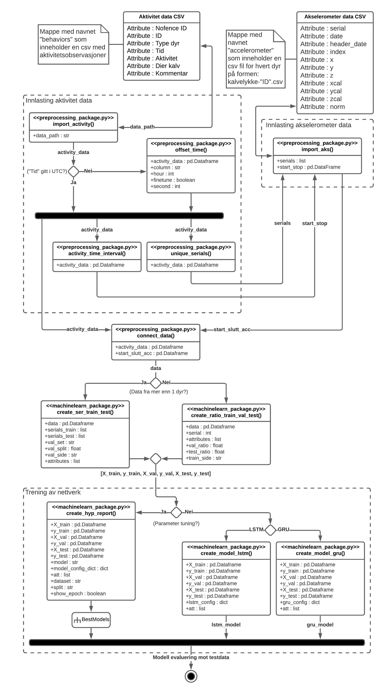

# MovementClassification_Thesis

Code and data for accelerometer data preprocessing and machine learning to classify movement in cows and calfs. Made for my master thesis. Special thanks to Nofence and Norsøk!

### Caution
To be able to run the python scrips a folder with accelerometerdata is needed, provided by Nofence with permission. One CSV file per calf with name "kalvelykke-ID.csv".

### Files and Folders:
- **MovementClassification_Thesis**
  - **behaviors**                                                 # Folder for classification data
    - **behaviors.csv**                                           # Classification done by Knut-Henning Kofoed for different movement categories. (multiclass)
    - **exported_behaviors_nofence.csv**                          # Classification provided by Nofence, rough cleaned for input to python script. (multiclass)
    - **ruminate**                                                # Classification done by Knut-Henning Kofoed for ruminateing. (binary classed)
  - **multiclass_behavior_split1.py**                             # Code used in thesis to create results for multiclass behavior, GRU/LSTM split 1
  - **multiclass_behavior_split2.py**                             # Code used in thesis to create results for multiclass behavior, GRU/LSTM split 2
  - **binary_behavior_split1.py**                                 # Code used in thesis to create results for binary behavior, GRU/LSTM split 1
  - **binary_behavior_split2.py**                                 # Code used in thesis to create results for binary behavior, GRU/LSTM split 2
  - **binary_ruminant_split1.py**                                 # Code used in thesis to create results for ruminant, GRU/LSTM split 1
  - **binary_ruminant_split2.py**                                 # Code used in thesis to create results for ruminant, GRU/LSTM split 2
  - **unsupervised.py**                                           # Code to do a simple k-means unsupervised classification
  - **MISC.py**                                                   # Different plot functions used to make graphs for thesis
  - **machinelearn_package.py**                                   # Collection of functions to be used for machine learning
  - **preprocessing_package.py**                                  # Collection of functions to be used for preprocessing
  - **visualize_package.py**                                      # Collection of functions to be used for visualizing data and results

### Figure of packages made and its content: 
  

### Scripts used in thesis: 
  
 
### Using the packages to classify: 
  
